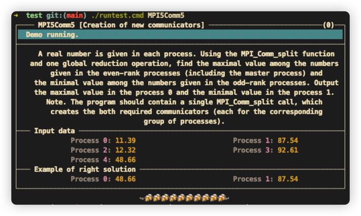
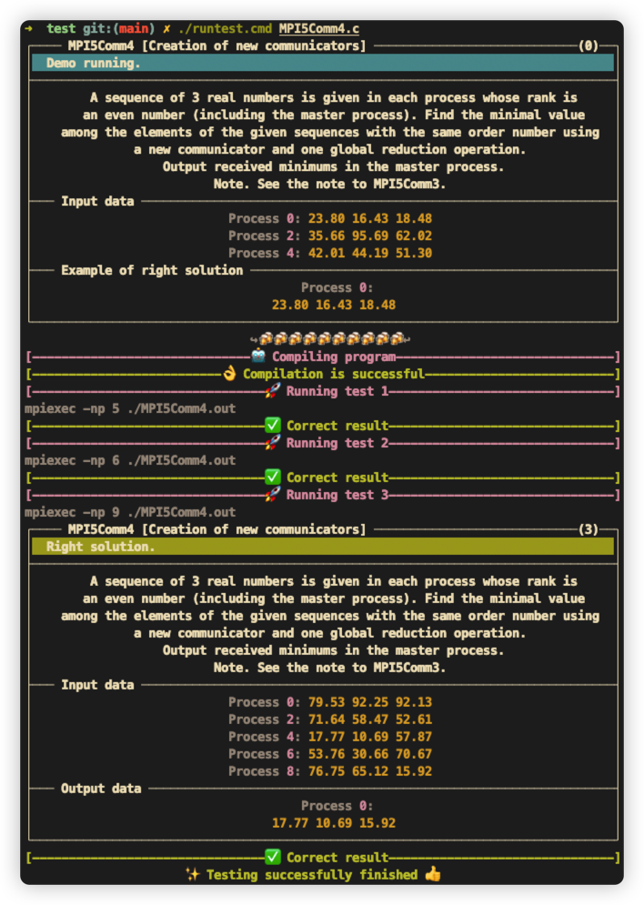

# Screenshot

## Show Task Description


## Run a task


Still interest? Turn to my [thesis](https://github.com/leiluoo/thesis) for more info!✨

# How to run

firstly, intall MPICH on your machine
```bash
apt install mpich
```
then clone the repo
```bash
git clone https://github.com/leiluoo/unixTaskbook.git
```

```bash
cd unixTaskbook; ./runlib.cmd; ./run.cmd
```

After done this, you can go to test file to try some examples.

Have fun!💗
