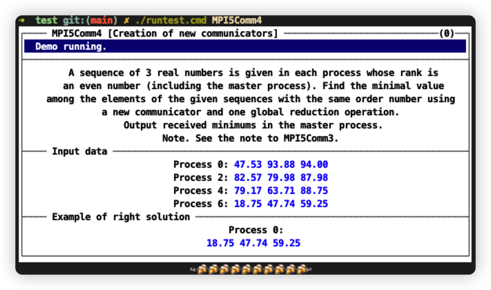

# Screenshot

## Show Task Description


## Run a task


Still interest? Turn to my [thesis](https://github.com/leiluoo/thesis) for more info!✨

# How to run

firstly, intall MPICH on your machine
```bash
apt install mpich
```
then clone the repo
```bash
git clone https://github.com/leiluoo/unixTaskbook.git
```

```bash
cd unixTaskbook; ./runlib.cmd; ./run.cmd
```

## Themes

It is easy to define your own color theme by changing the rgb code in config.yml file. And don't forget add -c parameter in runtest.cmd after command unixTaskbook.

* -c custom - use custom color theme
* -c white  - use white theme
* -c black  - use black theme

If there is no -c parameter, it will use black theme by default 

### black


### exmaple of custom theme


After done this, you can go to test file to try some examples.

Have fun!💗
